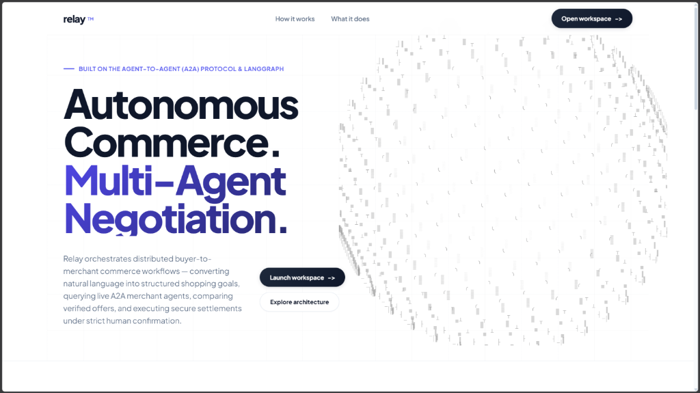
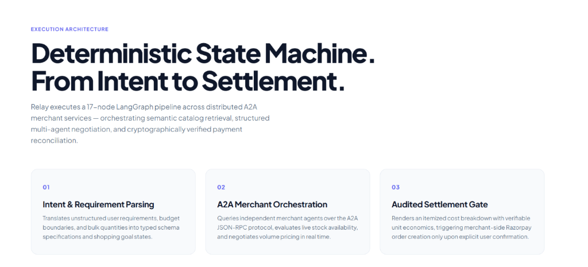
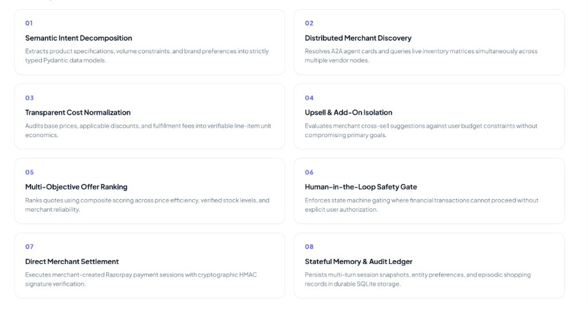
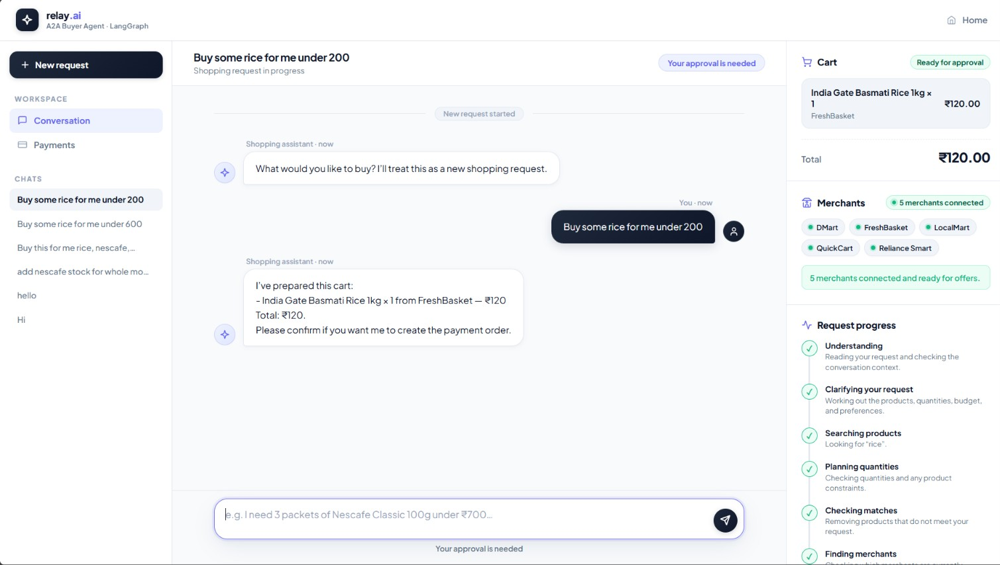
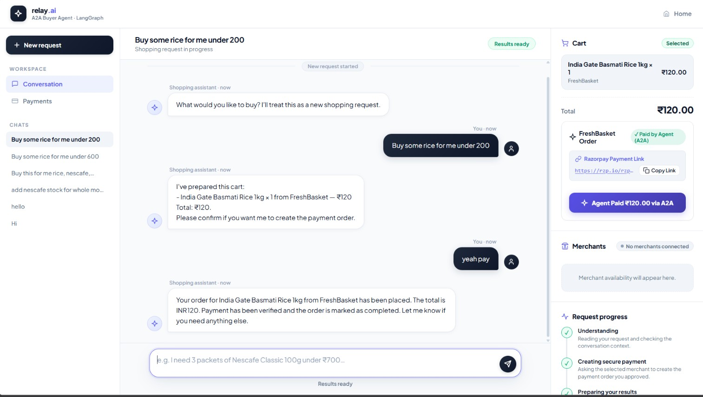

# Relay — Autonomous Agent-to-Agent (A2A) Commerce Engine

**Relay** is a production-grade multi-agent commerce system built on Google's **Agent-to-Agent (A2A) protocol** and **LangGraph**. It transforms unstructured natural language requests into structured shopping goals, queries distributed live merchant agents via asynchronous JSON-RPC, evaluates real-time inventory and pricing, negotiates volume discounts, and reconciles transactions with human-in-the-loop cryptographic payment verification.

> 📖 **Documentation Links:**
>
> - [System Architecture](docs/architecture.md) — Plain-language explanation of the Buyer Agent, Merchant Agents, memory, retrieval, A2A communication, and payment boundaries.
> - [Interactive Demo Guide](docs/demo.md) — Walkthrough of the workspace, cart negotiation, and checkout settlement.
> - [Open the local demo](frontend/index.html) — Open the frontend directly, or run the backend first for the full interactive experience.

---

---

## Visual Overview & Interactive Workspace

For the complete architecture explanation, see [docs/architecture.md](docs/architecture.md). The local interactive demo is available through [frontend/index.html](frontend/index.html).

### 1. Landing Interface & Autonomous Agent-to-Agent Architecture



### 2. Deterministic Execution Architecture



### 3. Core Multi-Agent Capabilities (Horizontal Architecture)



### 4. Interactive Workspace with Live Cart Negotiation & Settlement


## Demo Screenshots

The following screenshots show the running interactive workspace (example flows).





For more annotated examples see the demo page: [docs/demo.md](docs/demo.md)

## Memory Subsystem & State Persistence

Relay implements a **multi-tiered, durable SQLite memory subsystem** (`backend/agents/buyer/memory.py`), engineered specifically to maintain long-term user context and state continuity across restarts without conflating product vector search with user state.

```text
                                ┌───────────────────────────┐
                                │     BuyerMemory (SQLite)  │
                                └─────────────┬─────────────┘
                                              │
             ┌──────────────────┬─────────────┴───────┬──────────────────┐
             ▼                  ▼                     ▼                  ▼
     `buyer_sessions`    `buyer_entities`      `buyer_episodes`   `buyer_safety_events`
     ────────────────    ────────────────      ────────────────   ─────────────────────
     • Workflow State    • Brand Preferences   • Historical       • Prompt Injection
     • Active Cart       • Dietary Constraints   Outcomes           Interceptions
     • Process Recovery  • LRU Timestamps      • Goal Audits      • Zero-Token Leaks
```

### 1. Workflow & Session Memory (`buyer_sessions`)

- **State Snapshotting (`_workflow_snapshot`)**: Persists the minimal necessary graph state (`intent`, `shopping_goal`, `cart`, `selected_offers`, `awaiting_confirmation`, `cart_order_id`, `razorpay_order_id`) to disk after every turn.
- **Crash Resilience**: If the server restarts or worker recycling occurs mid-negotiation, the session state is seamlessly rehydrated without losing cart state or user confirmation flags.
- **Summary Caching (`_session_summary`)**: Generates compact, token-efficient summaries of ongoing carts for injection into LLM prompts.

### 2. Entity & User Profile Tracking (`buyer_entities`)

- **Dynamic Entity Upserting**: Automatically extracts and updates persistent customer preferences (`brand_preference`, `constraint`, `product_interest`) as the conversation evolves.
- **Composite Primary Keys `(buyer_id, entity_type, entity_key)`**: Guarantees idempotent updates and atomic overwrites when preferences change (e.g., brand switches or dietary updates).
- **Temporal Ranking**: Retrieves top active preferences ordered by `updated_at DESC` to bias product discovery towards current user affinities.

### 3. Episodic Commerce Memory (`buyer_episodes`)

- **Outcome Classification**: Categorizes past interactions into structured outcome types (`payment_order_created`, `purchase_confirmation_requested`, `recommendation_prepared`, `no_matching_offer`).
- **Context Injection**: Feeds the last $N$ episodic outcomes back into the intent understanding chain, allowing Relay to understand follow-ups like *"Order that same coffee from yesterday"* or *"Why did that order fail?"*.

### 4. Zero-Trust Security Ledger (`buyer_safety_events`)

- **Control-Plane Auditing**: Logs blocked prompt-injection attempts, policy violations, or unauthorized payload structures with category classifications and timestamps.
- **No Toxic Token Persistence**: Stores only the event category and metadata — never storing the adversarial prompt string itself, preventing persistent prompt injection.

---

## Core Engineering Concepts

### 1. Deterministic State Machine via LangGraph

Unlike naive autonomous agents that loop indefinitely or suffer from stochastic path divergence, Relay executes a **17-node directed acyclic graph (with controlled cyclic loops)**:

```text
[START]
  │
  ▼
understand ────────────► [intent = "greeting"/"general"] ──► respond ──► [END]
  │
  ├─────────────────────► [intent = "confirm_purchase"]  ──► purchase ──► respond ──► [END]
  │
  ▼ [intent = "shopping"]
build_shopping_goal
  │
  ▼
retrieve_product ◄─────── (Hybrid RRF FAISS + BM25)
  │
  ▼
plan_requirements ─────── (Estimates quantities & constraints)
  │
  ▼
relevance_gate ──────────► [no relevant items] ──► decide_substitution ──┐
  │                                                                       │
  ▼ [relevant items found]                                                │
discover ──────────────── (A2A Agent Card discovery on network)           │
  │                                                                       │
  ▼                                                                       │
query_merchants ───────── (Async JSON-RPC to live merchant nodes)         │
  │                                                                       │
  ▼                                                                       │
normalize_offers ──────── (Pydantic parsing of raw merchant responses)   │
  │                                                                       │
  ▼                                                                       │
evaluate_options ────────► [missing inventory] ──► decide_substitution ──┤
  │                                                      │                │
  ▼ [offers available]                                   ▼                │
negotiate ◄───────────────────────────────────── select_substitute ◄──────┘
  │                                                      │
  ▼                                                      ▼ [none available]
merchant_recommendations                              respond ──► [END]
  │
  ▼
build_cart
  │
  ▼
validate
  │
  ▼
await_purchase_confirmation ──► [END] (Halts for Human Authorization)
```

- **Strongly-Typed State**: State is modeled through `BuyerState` (`TypedDict`) ensuring all intermediate keys (`items`, `cart`, `candidate_offers`, `selected_offers`) are schema-compliant.
- **Controlled Cyclic Loops**: The `decide_substitution` $\to$ `select_substitute` $\to$ `query_merchants` loop allows the agent to iteratively search for suitable substitutes if primary items are out of stock.

### 2. A2A (Agent-to-Agent) Protocol Standard

Relay adheres to the open **Agent-to-Agent (A2A) JSON-RPC specification**:

- **Agent Cards (`/.well-known/agent-card.json`)**: Every merchant exposes its capabilities, supported interfaces, pricing skills, and catalog tags via structured agent cards.
- **Dynamic Discovery (`agents/buyer/discovery.py`)**: The buyer discovers active merchants dynamically across configurable network addresses rather than hardcoding endpoints.
- **Structured JSON-RPC Payload Exchange**: All price quotes, inventory inquiries, and negotiation requests use typed JSON-RPC 2.0 messages.

### 3. Hybrid Product Retrieval Engine

Located in `backend/retrieval/`:

- **Dense Vector Search**: FAISS vector index embedding product catalog metadata using `sentence-transformers/all-MiniLM-L6-v2`.
- **Sparse Lexical Search**: Rank-BM25 index for exact keyword matching (SKUs, weights, exact brand names).
- **Reciprocal Rank Fusion (RRF)**: Merges dense semantic hits with sparse lexical hits using standard RRF scoring:
  $$RRF\_Score(d) = \sum_{m \in \{dense, sparse\}} \frac{1}{k + rank_m(d)}$$
- **Cross-Encoder Re-ranking**: Final candidates are re-scored using `cross-encoder/ms-marco-MiniLM-L6-v2` before entering the LLM relevance gate.

### 4. Multi-Agent Negotiation & Offer Normalization

- **Autonomous Price Negotiation**: If quantities exceed merchant discount thresholds (e.g., $\ge 3$ units $\to 5\%$ off), the buyer agent automatically initiates a negotiation turn with the merchant agent.
- **Offer Normalization**: Merchant responses (which may include promotional language or bundled upsells) are parsed through Pydantic structured output chains (`llm.py`) into normalized line items:
  `{ product_name, unit_price, quantity, total_price, merchant_id, discount_applied }`
- **Upsell & Cross-Sell Isolation**: Merchant recommendations (e.g., milk with coffee) are separated from the core request and presented as optional suggestions without modifying the approved cart.

### 5. Zero-Trust Payment Security & Human-in-the-Loop Gating

- **Architectural Boundary**: The buyer agent has **zero payment gateway credentials**. It cannot initiate charges or generate payment orders.
- **Merchant-Owned Payment Orders**: When the human approves the cart, the buyer requests a checkout session from the **chosen merchant agent**. The merchant agent contacts Razorpay directly to generate `razorpay_order_id`.
- **HMAC-SHA256 Cryptographic Verification**: Payment signatures are validated server-side by the merchant using HMAC-SHA256:
  $$\text{Signature} = \text{HMAC-SHA256}(\text{order\_id} + "|" + \text{payment\_id}, \text{merchant\_secret})$$
- **Prompt Injection Defense**: Security boundary layers sanitize catalog metadata, merchant quotes, and user memory strings before prompt interpolation to protect the control plane.

### 6. Real-Time Server-Sent Events (SSE) Streaming

The backend exposes `POST /v1/buyer/messages/stream` using Starlette's `StreamingResponse`:

- Progress events (`progress`, `thinking`, `discovery`, `negotiation`, `cart_ready`, `awaiting_confirmation`) are dispatched in real-time as each LangGraph node finishes execution.
- The browser frontend renders live reasoning badges and status indicators with zero client-side polling.

---

## Directory Structure

```text
after/
├── backend/
│   ├── agents/
│   │   ├── buyer/                  # Buyer Orchestrator Agent
│   │   │   ├── graph.py            # 17-node LangGraph StateGraph
│   │   │   ├── llm.py              # Pydantic structured output LLM chains
│   │   │   ├── state.py            # BuyerState TypedDict definition
│   │   │   ├── service.py          # Session manager & SSE streaming coordinator
│   │   │   ├── buyer_server.py     # HTTP entry point (Starlette + Uvicorn)
│   │   │   ├── memory.py           # SQLite-backed durable session/entity/episodic memory
│   │   │   ├── discovery.py        # A2A merchant discovery & health resolution
│   │   │   ├── evaluation.py       # Multi-criteria offer scoring & selection
│   │   │   ├── negotiation.py      # Volume discount negotiation logic
│   │   │   ├── normalization.py    # Merchant prose → structured offer parsing
│   │   │   ├── relevance.py        # LLM relevance gate on catalog candidates
│   │   │   ├── substitution.py     # Out-of-stock alternative recommendation
│   │   │   ├── security.py         # Prompt injection sanitization & guardrails
│   │   │   ├── progress.py         # SSE event reporting context
│   │   │   └── merchant_checkout.py # Merchant order creation & verification client
│   │   └── merchant/               # Distributed Merchant Agents
│   │       ├── merchant_server.py  # A2A JSON-RPC server (Starlette)
│   │       ├── commerce.py         # Inventory checks, discounting & order lifecycle
│   │       ├── payments.py         # Direct Razorpay order creation & HMAC verification
│   │       ├── ledger.py           # Merchant-side SQLite transaction ledger
│   │       └── config.py           # Merchant configurations & initial inventory matrices
│   ├── retrieval/                  # Semantic Product Retrieval Subsystem
│   │   ├── hybrid.py               # RRF fusion (BM25 + FAISS)
│   │   ├── vector_store.py         # FAISS dense vector index manager
│   │   ├── embeddings.py           # SentenceTransformers embedding wrapper
│   │   ├── reranker.py             # Cross-Encoder re-ranker
│   │   └── indexer.py              # CLI index builder
│   ├── core/                       # Shared A2A protocol helpers
│   │   ├── protocol.py             # JSON-RPC request/response models
│   │   └── registry.py             # In-memory agent registry
│   └── data/                       # Catalogs, indexes, and databases
├── frontend/                       # Interactive Web Workspace
│   ├── index.html                  # Landing page and full workspace UI
│   ├── style.css                   # Custom CSS design system
│   └── app.js                      # Reactive SSE client, cart rendering, Razorpay integration
├── tests/                          # Pytest Test Suite
│   ├── test_buyer.py               # Graph, state & memory tests
│   ├── test_merchant.py            # Merchant commerce & discounting tests
│   └── test_server.py              # HTTP & SSE endpoint tests
├── Dockerfile                      # Production multi-stage Dockerfile
├── docker-compose.yml              # Multi-container orchestration
├── pyproject.toml                  # Python package & dependency configuration
└── .env.example                    # Environment template
```

---

## Tech Stack

| Layer | Technology |
|---|---|
| **Orchestration** | LangGraph (`StateGraph`, async node pipeline) |
| **LLM Inference** | Groq `openai/gpt-oss-120b` (via `langchain-groq`) |
| **Agent Protocol** | Google A2A SDK over JSON-RPC 2.0 |
| **Retrieval** | Hybrid FAISS (Dense) + Rank-BM25 (Sparse) with RRF |
| **Embeddings** | `sentence-transformers/all-MiniLM-L6-v2` |
| **Re-ranking** | `cross-encoder/ms-marco-MiniLM-L6-v2` |
| **Durable Memory** | SQLite (WAL mode, indexed session/entity/episodic tables) |
| **Payment Gateway** | Razorpay (HMAC-SHA256 cryptographic verification) |
| **Backend Framework** | Starlette + Uvicorn (Asynchronous ASGI) |
| **Package Manager** | [uv](https://github.com/astral-sh/uv) |

---

## Getting Started

### 1. Prerequisites

- **Python 3.13+**
- **[uv](https://docs.astral.sh/uv/)** (Fast Python package manager)
- **Groq API Key** (for fast LLM inference)
- **Razorpay Key Pair** (Test credentials from Razorpay dashboard)

### 2. Installation & Configuration

```bash
# Clone the repository
git clone <repo-url>
cd after

# Create your .env file
cp .env.example .env
```

Configure your `.env` file:

```env
GROQ_API_KEY=gsk_your_groq_api_key
RAZORPAY_KEY_ID=rzp_test_your_key_id
RAZORPAY_KEY_SECRET=your_razorpay_secret
BUYER_MODEL=openai/gpt-oss-120b
BUYER_REASONING_TEMPERATURE=0.2
A2A_AUTO_START_MERCHANTS=true
```

Install dependencies:

```bash
uv sync
```

### 3. Build the Retrieval Index

Generate the FAISS vector index and BM25 database from the product catalog:

```bash
uv run python -m retrieval.indexer
```

### 4. Start the Application

Start the Buyer Agent (which automatically spawns all bundled A2A merchant nodes):

```bash
uv run uvicorn agents.buyer.buyer_server:app --reload --port 8000 --app-dir backend
```

Open your browser at: **`http://localhost:8000`**

---

## Docker Deployment

Run the complete multi-agent cluster with a single command:

```bash
# Build and start via Docker Compose
docker compose up --build

# Run in detached mode
docker compose up -d
```

The container handles index initialization, runs the Starlette ASGI server on port 8000, and auto-spawns the merchant agent sub-processes.

---

## API Reference

### Buyer Endpoints

| Method | Endpoint | Description |
|---|---|---|
| `GET` | `/` | Serves landing page & web workspace |
| `GET` | `/health` | Health check endpoint (`{"status":"ok"}`) |
| `GET` | `/v1/checkout/config` | Returns public Razorpay key ID |
| `POST` | `/v1/buyer/messages` | Asynchronous JSON message processing |
| `POST` | `/v1/buyer/messages/stream` | Real-time Server-Sent Events (SSE) streaming |

#### Example Request (`POST /v1/buyer/messages`)

```json
{
  "message": "I need 4 packets of Nescafe Classic 100g and 2 cartons of Amul Taaza Milk under ₹1000",
  "session_id": "sess_8f3d1b9a",
  "buyer_id": "buyer_usr_104"
}
```

### Merchant Endpoints

| Method | Endpoint | Description |
|---|---|---|
| `GET` | `/.well-known/agent-card.json` | A2A Agent Card specification |
| `POST` | `/` | A2A JSON-RPC task handler |
| `POST` | `/v1/payments/verify` | Server-side HMAC-SHA256 payment signature verification |

---

## Test Suite

Run the automated pytest suite:

```bash
uv run pytest -v
```

Tests cover:

- LangGraph state flow and cyclic substitution loops
- SQLite durable memory read/write/upsert operations
- Merchant inventory management and volume discounting rules
- Razorpay order creation and HMAC-SHA256 signature verification
- Starlette HTTP routes and SSE streaming handlers

---

## Security & Verification Design

1. **Least Privilege Protocol**: The buyer orchestrator has no financial authority. It cannot create or debit payment sessions.
2. **Deterministic Human Approval Gate**: LangGraph state machine enforces human authorization before `purchase` state transition is reachable.
3. **Cryptographic Settlement**: Payment callbacks are validated against merchant HMAC-SHA256 secrets before marking orders complete in the ledger.
4. **Prompt Injection Firewalls**: Merchant payloads and product descriptions pass through sanitization filters before feeding LLM reasoning chains.
