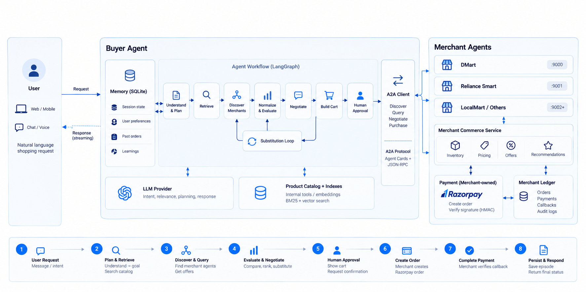

# Relay system architecture

## 1. What Relay does

Relay is an agent-to-agent shopping system. A user describes what they want in natural language. The Buyer Agent understands the request, searches the product catalog, asks multiple Merchant Agents for live offers, compares the results, and prepares a cart.

Relay does not place an order automatically. It shows the cart to the user and waits for explicit approval. After approval, the selected Merchant Agent creates the payment order and verifies the payment.

## Architecture diagram



The diagram shows the complete path from a user's natural-language request through the Buyer Agent, LangGraph workflow, memory and retrieval services, A2A merchant discovery, negotiation, human approval, and merchant-owned payment settlement.

The supporting workflow and capability views are also kept here because they describe system behavior rather than end-user screens.


The system has three main parts:

1. The user interface and Buyer Agent.
2. Shared services used by the Buyer Agent, such as memory, the language model, and product search.
3. Independent Merchant Agents that provide inventory, prices, offers, recommendations, and payment handling.

## 2. Main request flow

### Step 1: User request

The user sends a shopping request through the web interface. The request can include products, quantities, brands, budget, and constraints such as dietary preferences.

The Buyer API accepts the request, identifies the user session, and sends progress events back to the browser through Server-Sent Events (SSE).

### Step 2: Understand and plan

The Buyer Agent converts the request into structured data. For example, “I need coffee for five people under ₹1,000” becomes a product, quantity, people count, and budget.

The workflow is a LangGraph state machine. Each step receives and updates a typed `BuyerState`. Application code controls sensitive transitions such as purchase approval; the language model does not control them directly.

### Step 3: Retrieve products

The Buyer Agent searches the internal product catalog before contacting merchants. The search combines BM25 exact-word search, vector semantic search, Reciprocal Rank Fusion (RRF), and a cross-encoder re-ranker.

This produces a focused list of products to ask merchants about.

### Step 4: Discover and query merchants

The Buyer Agent discovers available Merchant Agents through A2A Agent Cards. An Agent Card describes a merchant’s name, endpoint, capabilities, and skills.

The Buyer Agent then sends typed JSON-RPC requests over HTTP. Requests can ask for inventory, prices, discounts, recommendations, or checkout.

Each merchant is independent. The Buyer Agent does not need to know the merchant’s internal implementation.

### Step 5: Normalize and evaluate offers

Merchant responses may use different formats. The Buyer Agent converts them into a common offer structure containing product name, quantity, unit price, total price, merchant ID, discount, and availability.

The evaluation step compares offers using the user’s requirements, price, availability, relevance, and constraints. Merchant recommendations remain separate from requested products, so optional upsells cannot silently change the cart.

### Step 6: Negotiate or find substitutes

If the quantity qualifies for a merchant discount, the Buyer Agent can negotiate through A2A.

If a product is unavailable or unsuitable, the workflow can choose a substitute and query merchants again. This is a controlled loop governed by workflow rules and validation logic.

### Step 7: Build and validate the cart

The Buyer Agent selects the best valid offers and builds a cart. Validation checks that the cart still matches the request and that totals and selected offers are consistent.

The workflow then pauses before any purchase action.

### Step 8: Ask for human approval

The user sees the cart and must explicitly confirm the purchase. A message such as “show me the cart” does not create a payment order.

This is the human-in-the-loop boundary. The Buyer Agent cannot skip it.

### Step 9: Merchant creates the payment order

After approval, the Buyer Agent asks the selected Merchant Agent to create a payment order.

Payment credentials remain on the merchant side. The Buyer Agent has no merchant payment secret and cannot create a Razorpay order directly.

### Step 10: Merchant verifies payment

The payment provider returns payment information to the Merchant Agent. The merchant verifies the payment signature using HMAC-SHA256 and records the result in its ledger.

The Buyer Agent receives only the result it needs, such as whether payment was verified and the current order status.

### Step 11: Persist the result and respond

The system saves the workflow state and commerce outcome. It returns the final status to the browser and records an episode that can help with future follow-up requests.

## 4. Buyer Agent components

### Buyer API and BuyerService

The Buyer API is the application boundary. It validates requests, creates sessions, calls the workflow, returns JSON responses, streams SSE progress, and hides internal errors from public responses.

`BuyerService` coordinates one user turn. It loads and saves session state, applies safety checks, manages session locks, handles provider rate limits, and calls LangGraph.

Main files: `backend/agents/buyer/buyer_server.py` and `backend/agents/buyer/service.py`.

### LangGraph workflow

The workflow understands the request, builds the shopping goal, retrieves products, discovers merchants, queries merchants, normalizes offers, evaluates and negotiates, selects substitutes, builds and validates the cart, waits for approval, and starts checkout after approval.

Main file: `backend/agents/buyer/graph.py`.

### Buyer memory

SQLite memory stores session state, user preferences, previous outcomes, and safety-event categories. It keeps product search separate from user memory: indexes answer “which products match?”, while memory answers “what do we know about this session and user?”.

Main file: `backend/agents/buyer/memory.py`.

### Product retrieval

The retrieval subsystem searches the catalog using BM25, vector search, RRF fusion, and re-ranking. It supplies candidates to the workflow before merchant queries begin.

Main directories: `backend/retrieval/` and `backend/data/`.

## 5. Merchant Agent components

Every merchant runs as an A2A-compatible service. It exposes an Agent Card and JSON-RPC endpoints so the Buyer Agent can discover and call it.

### Merchant commerce service

This service owns merchant-specific inventory, pricing, bulk discounts, recommendations, and order rules. Different merchants can use different rules without changing the Buyer Agent.

Main file: `backend/agents/merchant/commerce.py`.

### Merchant payment boundary

The merchant creates the Razorpay payment order and verifies the returned signature. This protects payment secrets and keeps the Buyer Agent as a shopping orchestrator rather than a payment processor.

Main file: `backend/agents/merchant/payments.py`.

### Merchant ledger

The ledger records orders, payments, callbacks, and audit information. It provides the merchant-side record of checkout activity.

Main file: `backend/agents/merchant/ledger.py`.

## 6. Engineering boundaries

| Boundary | Owner | Purpose |
|---|---|---|
| Browser ↔ Buyer API | Buyer service | Accept requests and stream progress |
| Buyer API ↔ LangGraph | Buyer workflow | Run one typed agent turn |
| Buyer workflow ↔ LLM | Buyer agent | Generate structured interpretations and responses |
| Buyer workflow ↔ catalog | Retrieval subsystem | Find relevant products |
| Buyer workflow ↔ merchants | A2A client and protocol | Discover and query independent agents |
| Buyer workflow ↔ payment | Merchant checkout client | Request checkout after approval |
| Merchant ↔ Razorpay | Merchant payment service | Create orders and verify signatures |
| Merchant ↔ ledger | Merchant service | Persist transaction and audit records |

## 7. Important safety rules

1. The Buyer Agent must not create a payment order before explicit human approval.
2. The Buyer Agent must not hold merchant payment secrets.
3. Merchant recommendations must not silently modify the approved cart.
4. Merchant responses and user memory must be sanitized before entering model prompts.
5. Purchase transitions must be controlled by application code and validation.
6. Payment verification must happen on the merchant side using the merchant secret.

## 8. Project locations

```text
frontend/                         Browser interface
backend/agents/buyer/             Buyer Agent, workflow, memory, A2A client
backend/agents/merchant/          Merchant Agent services and payment boundary
backend/retrieval/                BM25, vector search, RRF, and re-ranking
backend/data/                     Product catalog and index data
tests/                             Buyer, merchant, and server tests
docker-compose.yml                Local container deployment
```

## 9. One-sentence summary

Relay uses a stateful Buyer Agent to plan and compare shopping options across independent A2A Merchant Agents, pauses for human approval, and keeps payment creation and verification inside the selected merchant boundary.
